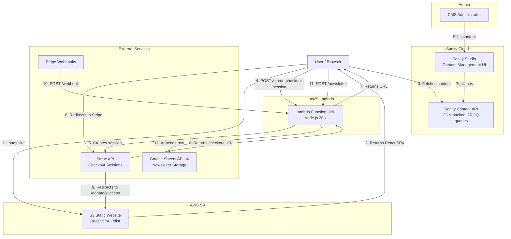

# GAICOM SYSTEM DOCUMENTATION

---

## 1. Executive Summary

### What GAICOM Is

GAICOM (Generative AI Community) is a nonprofit organization based in Livingston, NJ that bridges the gap between cutting-edge generative AI and the communities that stand to benefit the most. The GAICOM web platform serves as the organization's digital presence — providing information about the mission, hosting a blog, listing events, offering educational resources, accepting donations, and collecting newsletter subscriptions.

### What Problem It Solves

GAICOM addresses the growing AI learning gap. As generative AI reshapes industries, many communities — educators, small businesses, students, and nonprofits — lack accessible, understandable entry points into AI. The platform solves this by:

- Providing a central hub for AI education events and workshops
- Publishing blog content that demystifies AI concepts
- Curating resources for different experience levels
- Accepting donations to fund community AI programs
- Building a newsletter subscriber base for ongoing engagement

### High-Level Tech Stack

| Layer | Technology |
|-------|------------|
| Frontend | React 19, React Router 7, Tailwind CSS 4 |
| Build Tool | Vite 7 |
| Content Management | Sanity CMS (headless) |
| Static Hosting | AWS S3 (website-enabled bucket) |
| Backend | AWS Lambda (Node.js 20.x) with Function URL |
| Payments | Stripe Checkout Sessions |
| Newsletter Storage | Google Sheets via Google Sheets API v4 |
| Rich Text | Sanity Portable Text + @portabletext/react |

### Why Static Hosting + Headless CMS

This architecture was chosen for specific reasons:

1. **Cost efficiency** — S3 static hosting costs fractions of a penny per request compared to running a persistent server. For a nonprofit, this matters.
2. **Zero server management** — No EC2 instances, no patching, no uptime monitoring. The site is just files in a bucket.
3. **CMS flexibility** — Sanity's headless approach means non-technical administrators can update content without touching code. Content changes go live by publishing in Sanity Studio — no redeployment needed for CMS-driven content.
4. **Security posture** — Static files have minimal attack surface. The only backend exposure is through Lambda Function URLs, which handle payment processing and newsletter signups.
5. **Scalability** — S3 handles traffic spikes natively. Lambda scales to zero when idle and scales up automatically under load.

---

## 2. System Architecture

### A. Architecture Overview

The system follows a JAMstack-adjacent pattern: a statically-built React SPA served from S3, with dynamic content pulled client-side from Sanity's CDN, and serverless functions handling transactional operations (payments, newsletter signups).

There is no traditional web server. The React application is compiled to static HTML/JS/CSS via Vite, uploaded to an S3 bucket configured for static website hosting, and served directly to browsers. At runtime, the React app makes API calls to two external services:

1. **Sanity CDN** — for all content (blog posts, events, team members, testimonials, donation tiers, page text)
2. **AWS Lambda Function URL** — for transactional operations (Stripe checkout, Stripe webhooks, newsletter signup)

### B. Architecture Diagram



### C. Content Flow

1. A CMS administrator logs into Sanity Studio and creates or edits content (a blog post, event, testimonial, etc.).
2. On publish, Sanity stores the content in its cloud database and makes it available via the Content API with CDN caching.
3. When a user loads any page on the GAICOM site, the React components make client-side `fetch` calls using the Sanity client library with GROQ queries.
4. The Sanity CDN returns JSON data.
5. React components render the data. If the Sanity fetch fails, hardcoded fallback data is displayed instead.

Content is fetched on every page load (no build-time static generation). This means content updates in Sanity appear on the live site as soon as the CDN cache refreshes — typically within seconds.

### D. Payment Flow

1. User visits `/donate` and selects a donation tier ($25, $50, $100, $500) or enters a custom amount ($1–$5,000).
2. The React frontend sends a `POST` request to the Lambda endpoint `/create-checkout-session` with `{ "amount": <number> }`.
3. Lambda validates the amount (must be between 1 and 5000), then calls `stripe.checkout.sessions.create()` with:
   - Payment method: card
   - Product name: "GAICOM Donation"
   - Amount converted to cents (`amount * 100`)
   - Success URL: `{SUCCESS_URL}?session_id={CHECKOUT_SESSION_ID}`
   - Cancel URL: `{CANCEL_URL}`
4. Lambda returns the Stripe-hosted checkout page URL to the frontend.
5. The frontend redirects the user to Stripe's checkout page via `window.location.href = url`.
6. On successful payment, Stripe redirects the user to `/donate/success?session_id=cs_...`.
7. On cancellation, Stripe redirects to `/donate/cancel`.
8. Independently, Stripe sends a webhook `POST` to the Lambda `/webhook` endpoint. Lambda verifies the signature using `STRIPE_WEBHOOK_SECRET`, and on `checkout.session.completed`, logs the donation details (session ID, amount, currency, email) to CloudWatch.

### E. Newsletter Flow

1. User fills in first name, last name, and email in the newsletter form (visible on the Home page).
2. The React frontend validates inputs client-side (non-empty names, valid email format).
3. On submit, a `POST` request is sent to the Lambda `/newsletter` endpoint with `{ firstName, lastName, email }`.
4. Lambda validates the inputs server-side (same rules as frontend).
5. Lambda authenticates with Google via a service account credential stored in `GOOGLE_SERVICE_ACCOUNT_JSON`.
6. Lambda appends a row to a Google Sheet (`Sheet1!A:D`) with columns: firstName, lastName, email, ISO timestamp.
7. Lambda returns `{ "success": true }`.
8. The frontend shows a confirmation message: "Thank you for subscribing!"

### F. Local vs Production Behavior

| Aspect | Local (dev) | Production (S3) |
|--------|-------------|------------------|
| Frontend URL | `http://localhost:5173` | `http://gaicom-test-v1.s3-website-us-east-1.amazonaws.com` |
| Vite Dev Server | Yes (HMR enabled) | No — static files served from S3 |
| Sanity Data | Same CDN endpoint | Same CDN endpoint |
| Lambda API Base | Set via `VITE_DONATE_API_BASE` in `.env.local` | Baked into build from `.env.local` at build time |
| CORS | Lambda allows `localhost:5173` | Lambda allows the S3 bucket URL |
| Stripe Success URL | Configured in Lambda env vars — must match deployment | Points to S3 URL |
| SPA Routing | Vite dev server handles all routes | S3 must have error document set to `index.html` for client-side routing to work |

---

## 3. Frontend Technical Documentation

### Folder Structure

```
gaicom/
├── index.html                      # Vite entry HTML
├── vite.config.js                  # Vite + React + Tailwind plugins
├── package.json                    # Dependencies and scripts
├── .env                            # Sanity project credentials
├── .env.local                      # Lambda API base URL
├── .env.example                    # Template for environment setup
├── eslint.config.js                # ESLint flat config
├── public/
│   ├── gaicom-logo.png             # Favicon and logo
│   ├── blog-placeholder.svg        # Fallback blog image
│   ├── hero-1.jpg ... hero-4.png   # Hero carousel fallback images
│   ├── team/                       # Team member photos (8 files)
│   └── blog/
│       └── gaicom-launch.svg       # Blog post image
├── src/
│   ├── main.jsx                    # React DOM entry point
│   ├── App.jsx                     # BrowserRouter + Routes + Layout
│   ├── index.css                   # Tailwind imports + custom theme + animations
│   ├── Gaicom-logo.png             # Logo asset (in-source)
│   ├── pages/
│   │   ├── Home.jsx                # Landing page (hero, mission, vision, examples, testimonials, CTA, newsletter)
│   │   ├── About.jsx               # About page (story, values, team)
│   │   ├── Blog.jsx                # Blog listing page
│   │   ├── BlogPost.jsx            # Individual blog post (dynamic slug)
│   │   ├── Events.jsx              # Events with upcoming/past tabs
│   │   ├── Resources.jsx           # Resource directory
│   │   ├── Donate.jsx              # Donation page
│   │   ├── DonateSuccess.jsx       # Post-payment success
│   │   └── DonateCancel.jsx        # Post-payment cancellation
│   ├── components/
│   │   ├── Navbar.jsx              # Sticky navigation with mobile menu
│   │   ├── Footer.jsx              # Footer with contact, social links, quick links
│   │   ├── Button.jsx              # Polymorphic button (to/href/onClick)
│   │   ├── Card.jsx                # Reusable card with image/icon/CTA
│   │   ├── SectionWrapper.jsx      # Section container with padding/dark mode
│   │   ├── FormInput.jsx           # Form input with label and error display
│   │   ├── GaicomLogo.jsx          # Inline SVG logo component
│   │   ├── HeroCarousel.jsx        # Auto-rotating hero images (5s interval)
│   │   ├── MissionSection.jsx      # Mission audience cards
│   │   ├── VisionSection.jsx       # Vision with animated network SVG
│   │   ├── ExamplesSection.jsx     # AI use case examples
│   │   ├── TestimonialsSection.jsx # Auto-rotating testimonials (6s interval)
│   │   ├── CTASection.jsx          # Call-to-action section
│   │   ├── NewsletterSignup.jsx    # Newsletter form with API integration
│   │   ├── TeamSection.jsx         # Team member grid with avatar fallback
│   │   ├── BlogCard.jsx            # Blog post card for grid
│   │   ├── EventCard.jsx           # Event card component
│   │   ├── ResourceList.jsx        # Resource grid grouped by category
│   │   └── DonateInfo.jsx          # Donation tiers + custom amount + Stripe checkout
│   ├── lib/
│   │   ├── sanityClient.js         # Sanity client init + image URL builder
│   │   ├── sanityQueries.js        # All GROQ queries (13 exports)
│   │   └── portableTextSerializer.jsx  # Portable Text rendering components
│   └── data/
│       └── blogData.js             # Fallback blog post data
├── lambda/
│   └── index.mjs                   # AWS Lambda handler (Stripe + Newsletter + Webhook)
└── sanity-studio/                  # Sanity Studio project (separate package)
    ├── sanity.config.ts
    ├── sanity.cli.ts
    └── schemaTypes/                # 12 schema definitions
```

### Component Architecture

The application uses a flat component architecture with no nesting directories. Components fall into three categories:

**Layout Components** — Rendered once per page load, wrapping all routes:
- `Navbar` — Fixed-position navigation bar with scroll detection, mobile hamburger menu, and active link highlighting. Uses `useRef` for focus management and `useEffect` for scroll event listeners.
- `Footer` — Fetches site settings from Sanity for email, location, and social links. Falls back to hardcoded values.

**Page Components** — Mapped to routes in `App.jsx`. Each page fetches its own Sanity data in a `useEffect` on mount:
- `Home` — Composes HeroCarousel, MissionSection, VisionSection, ExamplesSection, TestimonialsSection, CTASection, and NewsletterSignup.
- `About` — Fetches about page content + renders TeamSection.
- `Blog` — Fetches blog post list, renders BlogCard grid.
- `BlogPost` — Fetches single post by slug, renders Portable Text or fallback plain text.
- `Events` — Fetches upcoming and past events, renders tabbed EventCard lists.
- `Resources` — Renders ResourceList.
- `Donate` — Renders DonateInfo.
- `DonateSuccess` — Reads `session_id` from URL query params, shows confirmation.
- `DonateCancel` — Shows cancellation notice with try-again link.

**Feature Components** — Reusable UI sections with data-fetching capabilities:
- `HeroCarousel` — Fetches hero slides from Sanity, auto-rotates every 5 seconds, renders navigation dots and arrows.
- `TestimonialsSection` — Fetches testimonials, auto-rotates every 6 seconds.
- `DonateInfo` — Fetches donation tiers and donation page content from Sanity, initiates Stripe checkout.
- `NewsletterSignup` — Fetches newsletter heading/subheading from Sanity, handles form submission to Lambda.
- `ResourceList` — Fetches resources, groups by category, renders external links.

### Blog Routing System

Blog uses dynamic slug-based routing:

**Route definition** in `App.jsx`:
```jsx
<Route path="/blog/:slug" element={<BlogPost />} />
```

**Slug extraction** in `BlogPost.jsx`:
```jsx
const { slug } = useParams();
```

**Data fetching** — The component first attempts to fetch from Sanity using the slug parameter:
```jsx
const data = await client.fetch(BLOG_POST_BY_SLUG_QUERY, { slug });
```

The GROQ query filters by `slug.current == $slug`:
```groq
*[_type == "blogPost" && slug.current == $slug && !(_id in path("drafts.**"))][0]{ ... }
```

**Fallback** — If Sanity returns no data (or the fetch fails), the component falls back to the local `blogData.js` file:
```jsx
const fallback = getBlogBySlug(slug);
```

**Content rendering** — The component detects whether the post body is Portable Text (from Sanity) or plain text (from fallback data):
```jsx
const hasPortableText = Array.isArray(data.body) && data.body.length > 0 && data.body[0]?._type;
```

If Portable Text, it renders using `@portabletext/react` with custom serializers. Otherwise, it renders paragraphs from the fallback `content` array.

### CMS Queries (GROQ)

All GROQ queries are centralized in `src/lib/sanityQueries.js`. There are 13 exported queries:

| Query | Purpose | Used By |
|-------|---------|---------|
| `SITE_SETTINGS_QUERY` | Site name, logo, contact email, location, social links | Footer |
| `HOME_PAGE_QUERY` | All home page section text + ordered arrays | HeroCarousel, MissionSection, ExamplesSection, NewsletterSignup, CTASection, TestimonialsSection |
| `HERO_SLIDES_QUERY` | Active hero carousel images in order | HeroCarousel |
| `TESTIMONIALS_QUERY` | Active testimonials in order | TestimonialsSection |
| `TEAM_MEMBERS_QUERY` | Active team members in order | TeamSection |
| `UPCOMING_EVENTS_QUERY` | Events with `startDateTime > now()` | Events page |
| `PAST_EVENTS_QUERY` | Events with `startDateTime < now()` | Events page |
| `RESOURCES_QUERY` | Active resources ordered by category then order | ResourceList |
| `BLOG_POSTS_QUERY` | Published blog posts (excludes drafts) | Blog page |
| `BLOG_POST_BY_SLUG_QUERY` | Single blog post with author details | BlogPost page |
| `ABOUT_PAGE_QUERY` | About page hero, story, values | About page |
| `DONATION_TIERS_QUERY` | Active donation tiers in order | DonateInfo |
| `DONATE_PAGE_QUERY` | Impact section content and custom amount limits | DonateInfo |

### State Management

The application uses **component-level React state exclusively**. There is no global state library (no Redux, no Zustand, no Context API). Each component manages its own state via `useState` and `useEffect`.

Common pattern across all data-fetching components:

```jsx
const [data, setData] = useState(FALLBACK_DATA);

useEffect(() => {
  async function fetchData() {
    try {
      const result = await client.fetch(QUERY);
      if (result) setData(result);
    } catch (err) {
      console.error('Failed to fetch:', err);
      // fallback data remains in state
    }
  }
  fetchData();
}, []);
```

This pattern ensures the UI always renders — either with CMS data or with hardcoded fallbacks.

### API Calls to Lambda

There are exactly two API integrations with the Lambda backend:

**1. Stripe Checkout** (`src/components/DonateInfo.jsx`):
```jsx
const API_BASE = import.meta.env.VITE_DONATE_API_BASE || '';

const res = await fetch(`${API_BASE}/create-checkout-session`, {
  method: 'POST',
  headers: { 'Content-Type': 'application/json' },
  body: JSON.stringify({ amount }),
});
const { url } = await res.json();
window.location.href = url;  // Full page redirect to Stripe
```

**2. Newsletter Signup** (`src/components/NewsletterSignup.jsx`):
```jsx
const API_BASE = import.meta.env.VITE_DONATE_API_BASE || '';

const res = await fetch(`${API_BASE}/newsletter`, {
  method: 'POST',
  headers: { 'Content-Type': 'application/json' },
  body: JSON.stringify({ firstName, lastName, email }),
});
```

Both use the same `VITE_DONATE_API_BASE` environment variable as their base URL.

### Environment Variable Usage

The frontend uses four Vite environment variables (prefixed with `VITE_` to be exposed to client code):

| Variable | Purpose | Used In |
|----------|---------|---------|
| `VITE_SANITY_PROJECT_ID` | Sanity project ID (`02ubmxqm`) | `sanityClient.js` |
| `VITE_SANITY_DATASET` | Sanity dataset name (`production`) | `sanityClient.js` |
| `VITE_SANITY_API_VERSION` | Sanity API version (`2025-01-01`) | `sanityClient.js` |
| `VITE_DONATE_API_BASE` | Lambda Function URL base | `DonateInfo.jsx`, `NewsletterSignup.jsx` |

These are accessed via `import.meta.env.VITE_*` (Vite's environment variable mechanism). They are embedded into the JavaScript bundle at build time — they are not secret.

### Build Process

**Command:** `npm run build`

This runs `vite build`, which:

1. Reads `index.html` as the entry point.
2. Processes `src/main.jsx` and all imports.
3. Compiles JSX to JavaScript.
4. Processes Tailwind CSS via the `@tailwindcss/vite` plugin (no separate PostCSS config needed).
5. Tree-shakes unused code.
6. Outputs optimized, hashed bundles to the `dist/` directory.

**The `dist/` directory contains:**
- `index.html` — The entry HTML file
- `assets/` — Hashed JS and CSS bundles
- All files from `public/` (images, SVGs, etc.)

### S3 Deployment

After `npm run build`:

1. The entire contents of `dist/` are uploaded to the S3 bucket `gaicom-test-v1`.
2. The bucket is configured for static website hosting with:
   - Index document: `index.html`
   - Error document: `index.html` (required for SPA client-side routing — any 404 returns the React app, which then handles the route)
3. The bucket policy allows public read access.
4. The site is accessible at `http://gaicom-test-v1.s3-website-us-east-1.amazonaws.com`.

After deployment, the React app loads in the browser, fetches content from Sanity's CDN, and functions identically to the local dev version.

---

## 4. Backend / Lambda Documentation

### Overview

All backend logic is contained in a single file: `lambda/index.mjs`. This Lambda function is exposed via an AWS Lambda Function URL (not API Gateway). It handles three routes and a CORS preflight handler.

**Runtime:** Node.js 20.x
**Dependencies:** `stripe`, `googleapis`

### Route: POST /create-checkout-session

**Purpose:** Creates a Stripe Checkout Session for a donation and returns the Stripe-hosted checkout page URL.

**Endpoint:** `POST {LAMBDA_FUNCTION_URL}/create-checkout-session`

**Request format:**
```json
{
  "amount": 50
}
```

**Validation rules:**
- `amount` must be a number
- Must be between 1 and 5000 (inclusive)

**Success response (200):**
```json
{
  "url": "https://checkout.stripe.com/c/pay/cs_test_..."
}
```

**Error responses:**

Invalid JSON (400):
```json
{
  "error": "Invalid JSON body"
}
```

Invalid amount (400):
```json
{
  "error": "Amount must be between $1 and $5,000"
}
```

Server error (500):
```json
{
  "error": "Failed to create checkout session"
}
```

**Stripe integration logic:**
```javascript
const session = await stripe.checkout.sessions.create({
  payment_method_types: ['card'],
  mode: 'payment',
  line_items: [{
    price_data: {
      currency: 'usd',
      product_data: { name: 'GAICOM Donation' },
      unit_amount: Math.round(amount * 100),  // Stripe uses cents
    },
    quantity: 1,
  }],
  success_url: process.env.SUCCESS_URL + '?session_id={CHECKOUT_SESSION_ID}',
  cancel_url: process.env.CANCEL_URL,
});
```

**Environment variables used:**
- `STRIPE_SECRET_KEY` — Stripe API key
- `SUCCESS_URL` — Redirect URL after successful payment
- `CANCEL_URL` — Redirect URL after cancelled payment

---

### Route: POST /webhook

**Purpose:** Receives and validates Stripe webhook events. Logs completed donation information to CloudWatch.

**Endpoint:** `POST {LAMBDA_FUNCTION_URL}/webhook`

**Request format:** Raw request body from Stripe with `stripe-signature` header.

**Webhook validation logic:**
```javascript
const sig = event.headers?.['stripe-signature'];
const rawBody = event.isBase64Encoded
  ? Buffer.from(event.body, 'base64').toString('utf-8')
  : event.body;

const stripeEvent = stripe.webhooks.constructEvent(
  rawBody,
  sig,
  process.env.STRIPE_WEBHOOK_SECRET
);
```

The function handles base64-encoded bodies (Lambda Function URLs may base64-encode the body). It uses `stripe.webhooks.constructEvent()` to verify the webhook signature, preventing forged requests.

**Handled event:** `checkout.session.completed`

On this event, the function logs:
- Session ID
- Amount (converted from cents to dollars)
- Currency
- Customer email

**Success response (200):**
```json
{
  "received": true
}
```

**Signature failure response (400):**
```
Webhook signature verification failed
```

**Environment variables used:**
- `STRIPE_SECRET_KEY` — For Stripe client initialization
- `STRIPE_WEBHOOK_SECRET` — For webhook signature verification

---

### Route: POST /newsletter

**Purpose:** Validates subscriber data and appends it to a Google Sheet.

**Endpoint:** `POST {LAMBDA_FUNCTION_URL}/newsletter`

**Request format:**
```json
{
  "firstName": "Jane",
  "lastName": "Doe",
  "email": "jane@example.com"
}
```

**Validation rules:**
- `firstName`: Required, non-empty after trimming
- `lastName`: Required, non-empty after trimming
- `email`: Required, must match `/^[^\s@]+@[^\s@]+\.[^\s@]+$/`

**Success response (200):**
```json
{
  "success": true
}
```

**Validation error response (400):**
```json
{
  "error": "Validation failed",
  "errors": {
    "firstName": "First name is required.",
    "email": "Please enter a valid email."
  }
}
```

**Server error response (500):**
```json
{
  "error": "Failed to save subscription"
}
```

**Google Sheets integration:**
```javascript
const credentials = JSON.parse(process.env.GOOGLE_SERVICE_ACCOUNT_JSON);
const auth = new google.auth.GoogleAuth({
  credentials,
  scopes: ['https://www.googleapis.com/auth/spreadsheets'],
});
const sheets = google.sheets({ version: 'v4', auth });

await sheets.spreadsheets.values.append({
  spreadsheetId: process.env.SPREADSHEET_ID,
  range: 'Sheet1!A:D',
  valueInputOption: 'USER_ENTERED',
  requestBody: {
    values: [[firstName, lastName, email, new Date().toISOString()]],
  },
});
```

**Environment variables used:**
- `GOOGLE_SERVICE_ACCOUNT_JSON` — Full JSON credential for a Google service account
- `SPREADSHEET_ID` — The ID of the target Google Sheet

---

### CORS Strategy

CORS is handled entirely within the Lambda function — there is no API Gateway or CloudFront layer.

**Allowed origins:**
```javascript
const ALLOWED_ORIGINS = [
  'http://localhost:5173',
  'http://gaicom-test-v1.s3-website-us-east-1.amazonaws.com',
];
```

**Header logic:**
```javascript
function getCorsHeaders(event) {
  const origin = event?.headers?.origin || '';
  const allowedOrigin = ALLOWED_ORIGINS.includes(origin) ? origin : ALLOWED_ORIGINS[0];
  return {
    'Access-Control-Allow-Origin': allowedOrigin,
    'Access-Control-Allow-Headers': 'content-type, stripe-signature',
    'Access-Control-Allow-Methods': 'POST, OPTIONS',
  };
}
```

The function checks the request `origin` header against the whitelist. If the origin matches, it echoes it back. If not, it defaults to `localhost:5173`. This means unknown origins will receive CORS headers for localhost, which browsers will correctly reject in production.

**Preflight handling:** `OPTIONS` requests return `204 No Content` with the CORS headers.

**Allowed headers:** `content-type` (for JSON payloads) and `stripe-signature` (for webhook verification).

**Allowed methods:** `POST` and `OPTIONS` only. No `GET`, `PUT`, or `DELETE`.

---

### Error Handling Strategy

Every route follows the same error handling pattern:

1. **Parse body** — Wrapped in try/catch. Returns `400` with `"Invalid JSON body"` on parse failure.
2. **Validate inputs** — Returns `400` with specific error messages.
3. **Execute business logic** — Wrapped in try/catch. Returns `500` with a generic message on failure. Actual error messages are logged to CloudWatch via `console.error`.
4. **Fallback** — Any unmatched route returns `404` with `{ "error": "Not found" }`.

All responses include CORS headers. Error details are never exposed to the client beyond generic messages.

---

## 5. CMS User Guide (Non-Tech Friendly)

### 5.1 Five-Minute Quick Start

If you are new to the CMS, complete these steps in order:

- [ ] Get your Sanity Studio login credentials from the developer (Google or email/password).
- [ ] Open the Sanity Studio URL in your browser and log in.
- [ ] Explore the left sidebar — click through "Home Page," "Blog Posts," "Events," etc. to see what is already there.
- [ ] Open any existing document, read the field descriptions, and notice the red asterisks on required fields.
- [ ] Make a small edit to a non-critical field (e.g., change a testimonial's role text), then click **"Publish"**.
- [ ] Open the live website in another tab and verify your change appears within 30–60 seconds.
- [ ] Read the "Golden Rules" section (5.5) below before making further edits.

### 5.2 Logging In

1. Open the Sanity Studio URL provided by your developer in any modern browser (Chrome, Firefox, Edge, Safari).
2. Log in with your Sanity account — either Google sign-in or email/password.
3. After logging in, you will see the **sidebar** on the left with all content sections.

If you cannot log in, confirm with your developer that your email has been added to the Sanity project as a member.

### 5.3 Navigation Basics

The sidebar is organized into two groups:

**Singleton Pages** — One document each. You edit the existing document directly. You cannot create a second copy.

| Sidebar Item | What It Controls |
|---|---|
| Site Settings | Site name, logo, contact email, location, social media links |
| Home Page | Hero text, mission section, vision heading, examples, testimonials heading, CTA, newsletter text |
| About Page | Hero heading, story paragraphs, values |
| Donate Page | Impact heading/stats, testimonial quote, custom donation amount limits |

**Collections** — You can create many documents of each type.

| Sidebar Item | What It Controls |
|---|---|
| Hero Slides | Rotating background images on the home page hero |
| Testimonials | Quotes displayed in the testimonials carousel |
| Team Members | People shown on the About page |
| Events | Upcoming and past events on the Events page |
| Resources | Links, files, and tools on the Resources page |
| Blog Posts | Articles on the Blog page |
| Authors | Blog post author profiles |
| Donation Tiers | Preset donation amounts shown on the Donate page |

**Tabs within documents.** Some documents (Blog Posts, Events, Home Page, About Page) split their fields into tabs at the top of the editor — for example "Content," "Media," "Metadata," and "SEO." Click each tab to see all fields.

### 5.4 How Publishing Works

Sanity uses a **draft/published** system:

- When you create a new document or edit an existing one, your changes are saved as a **draft**. Drafts are not visible on the live website.
- When you click **"Publish"** (bottom-right of the editor), the draft becomes the published version. The live website will reflect the change within seconds to one minute (CDN caching may cause a brief delay).
- If you want to undo unsaved changes, click **"Discard Changes"** to revert to the last published version.
- You can tell if a document has unpublished changes by looking for the yellow "edited" indicator next to the document title.

**Important:** You cannot publish if there are validation errors. The CMS will highlight fields in red and display error messages explaining what needs to be fixed.

### 5.5 Golden Rules and Guardrails

The CMS has two types of rules: **enforced guardrails** that the system physically prevents you from violating, and **manual rules** that are team policy and require your attention.

#### 5.5a Enforced Guardrails (The CMS Will Stop You)

These rules are built into the CMS validation. If you violate them, the Publish button will be blocked and you will see an error message.

**Limits on active items:**
- **Hero Slides:** Maximum **4** active slides at a time. The CMS will reject a 5th active slide with the message: "Maximum 4 active hero slides allowed. Deactivate another slide first."
- **Testimonials:** Maximum **10** active testimonials at a time.
- **Donation Tiers:** Maximum **6** active tiers at a time.

**Unique order numbers:**
- **Hero Slides, Testimonials, Donation Tiers:** Each active item must have a unique order number. If you try to assign the same order number as another item, the CMS will tell you which item already uses that number.
- **Team Members, Resources:** Order numbers must also be unique if provided. For resources, uniqueness is checked within the same category.

**Only one featured donation tier:**
- Only one donation tier can have the "Featured (Most Popular)" toggle turned on. If another tier is already featured, you must unmark it first.

**Required fields (red asterisks):**
- Most content types have required fields that must be filled in before publishing. The CMS displays specific error messages for each. See the step-by-step guides below for exactly which fields are required per content type.

**Character limits:**
- Many text fields have minimum and maximum character limits. The CMS displays the error inline if you exceed them.

**Cross-field validation:**
- **Events:** If the event is in the future (start date is after today), a registration link is required.
- **Events:** If you set an end date/time, it must be after the start date/time.
- **Blog Posts:** If you set an "Updated At" date, it must be after the "Published At" date.
- **Blog Posts:** Read Time must follow the format "X min read" (e.g., "5 min read").
- **Donate Page:** If you add a testimonial quote, you must also add a testimonial author (and vice versa).
- **Donate Page:** The custom amount maximum must be greater than the custom amount minimum.
- **Resources:** Each resource must have either an emoji icon OR an uploaded icon image (or both).

#### 5.5b Manual Rules (Team Policy — Not Enforced by the CMS)

These are best practices your team should follow. The CMS will not stop you from breaking them.

- **Do not delete singleton pages** (Site Settings, Home Page, About Page, Donate Page). The website will fall back to default text instead of your content.
- **Do not delete authors that are linked to blog posts.** Deleting the author will cause linked blog posts to display no author name.
- **Do not change a blog post or event slug after sharing the URL.** Old links will break.
- **Keep images under 500KB.** Large images slow down the website. The CMS accepts any file size, but performance suffers.
- **Use recommended image dimensions:** Hero slides at 1920x800+ (landscape), blog images at 800px+ wide, team photos at 400x400+ (square).
- **Always set the "Active" toggle intentionally.** Items with Active set to false will not appear on the website at all, even if fully filled out.

### 5.6 Step-by-Step: Managing Hero Slides

Hero slides are the rotating background images in the hero section at the top of the home page.

**To add a new hero slide:**
1. Click **"Hero Slides"** in the sidebar.
2. Click the **"+"** button at the top to create a new slide.
3. Fill in the required fields:
   - **Title (Internal Reference)** — A label to identify this slide in the studio (1–100 characters). Not shown on the website.
   - **Image** — Upload a high-resolution landscape image (recommended 1920x800 or larger). Use the hotspot tool to set the focal point.
   - **Alt Text** — Describe what the image shows for screen readers and SEO (5–200 characters). Example: "Community members collaborating on AI project."
   - **Order** — A number from 1–4 that sets the slide position. Must be unique — no two slides can share the same order number.
   - **Active** — Toggle on to display this slide. Maximum 4 active slides allowed.
4. Click **"Publish"**.

**To deactivate a slide without deleting it:**
1. Open the slide.
2. Toggle **"Active"** to off.
3. Click **"Publish"**.
The slide will no longer appear on the website but will remain in the CMS for future use. Its list entry will show "[INACTIVE]".

### 5.7 Step-by-Step: Managing Testimonials

**To add a new testimonial:**
1. Click **"Testimonials"** in the sidebar.
2. Click **"+"** to create a new testimonial.
3. Fill in the required fields:
   - **Quote** — The testimonial text (10–500 characters).
   - **Author** — Full name of the person (2–100 characters).
   - **Order** — A unique positive integer for display position.
   - **Active** — Toggle on to show it. Maximum 10 active testimonials allowed.
4. Optionally fill in:
   - **Role** — Job title or role. Optional, but must be at least 2 characters if provided.
   - **Organization** — Company or organization name. Optional, but must be at least 2 characters if provided.
5. Click **"Publish"**.

### 5.8 Step-by-Step: Managing Team Members

**To add a new team member:**
1. Click **"Team Members"** in the sidebar.
2. Click **"+"** to create a new team member.
3. Fill in the required fields:
   - **Name** — Full name (2–100 characters).
   - **Initials** — 1–3 uppercase letters (e.g., "JS" for John Smith). Used as a fallback if the photo fails to load. The CMS enforces uppercase.
   - **Photo** — Upload a professional headshot. Square images work best (400x400+).
   - **Bio** — Short biography (10–500 characters).
4. Optionally fill in:
   - **Social Links** — Click "Add item" to add links. For each link, select a **Platform** from the dropdown (LinkedIn, Twitter, GitHub, Website) and enter the **URL**. Both fields are required per link entry.
   - **Order** — A positive integer for display position. If provided, must be unique among all team members.
   - **Active** — Defaults to on. Only active members appear on the website.
5. Click **"Publish"**.

### 5.9 Step-by-Step: Managing Events

**To add a new event:**
1. Click **"Events"** in the sidebar.
2. Click **"+"** to create a new event.
3. Fill in the **Content** tab:
   - **Title** — Event name (3–150 characters).
   - **Slug** — Click "Generate" to create a URL-friendly version of the title. Required.
   - **Start Date & Time** — When the event begins. Required. This field determines whether the event appears under "Upcoming" or "Past" on the website.
   - **End Date & Time** — Optional. If set, must be after the start date.
   - **Description** — Event details (10–1000 characters).
   - **Date Display** — Optional. How the date appears on event cards (e.g., "March 24" or "June 10–12"). Max 50 characters.
   - **Location** — Select from the dropdown (Livingston NJ, Virtual Zoom, Virtual Google Meet, Hybrid) or type a custom location.
4. Fill in the **Media** tab (optional):
   - **Image** — Event banner or promotional image.
5. Fill in the **Links** tab:
   - **Registration Link** — URL where attendees can register. **Required for upcoming events** (events with a start date in the future). The CMS will block publishing if this is missing for a future event.
   - **Recap Link** — Optional. Link to a recording or summary for past events.
6. Click **"Publish"**.

**How events appear on the website:** Events with a start date in the future appear under the "Upcoming" tab (sorted by soonest first). Events with a start date in the past appear under the "Past" tab (sorted by most recent first).

### 5.10 Step-by-Step: Managing Resources

**To add a new resource:**
1. Click **"Resources"** in the sidebar.
2. Click **"+"** to create a new resource.
3. Fill in the required fields:
   - **Title** — Resource name (3–150 characters).
   - **Icon (Emoji)** — An emoji like "📚" or "🤖". You must provide either an emoji icon OR an icon image (or both). If neither is provided, the CMS will show an error.
   - **Icon Image** — Upload a custom icon image. An alternative to the emoji icon.
   - **Description** — What this resource is about (10–500 characters).
   - **Category** — Select one from the radio buttons: "Getting Started," "Tools & Platforms," or "Research & Policy." Required.
4. Optionally fill in:
   - **External Link** — URL to an external resource.
   - **File Upload** — Upload a downloadable file (PDF, doc, etc.).
   - **Tags** — Select relevant tags from the predefined list (AI, Machine Learning, Education, Community, Ethics, Policy, Tools, Tutorial, Workshop, Beginner, Intermediate, Advanced).
   - **Order** — Display position within the category. Must be a positive integer and unique within the same category.
   - **Active** — Defaults to on. Only active resources appear on the website.
5. Click **"Publish"**.

### 5.11 Step-by-Step: Managing Blog Posts

**To create a new blog post:**
1. Click **"Blog Posts"** in the sidebar.
2. Click **"+"** to create a new post.
3. Fill in the **Content** tab:
   - **Title** — The headline (5–200 characters).
   - **Slug** — Click "Generate" to create a URL from the title. Required. This becomes the URL: `gaicom.org/blog/your-slug-here`.
   - **Excerpt** — A short summary shown in blog listings (10–300 characters).
   - **Body** — The full article. Required (at least one block of content). You can add:
     - Paragraphs of text
     - Headings (H2, H3, H4)
     - Bold, italic, and inline code formatting
     - Links (a valid URL is required for each link; supports http, https, mailto)
     - Images (alt text is **required** for every inline image)
     - Block quotes
4. Fill in the **Media** tab:
   - **Main Image** — The featured image for the post. Required.
   - **Image Alt Text** — Description of the main image (5–200 characters). Required.
5. Fill in the **Metadata** tab:
   - **Author** — Select an existing author from the dropdown. Required.
   - **Published At** — The publication date. Required. Set to today's date and time for new posts.
   - **Read Time** — Required. Must follow the exact format: `X min read` (e.g., "5 min read" or "12 min read"). The CMS validates this format.
   - **Updated At** — Optional. Set this when making significant updates to a published post. Must be after the Published At date.
   - **Categories** — Optional. Select from the predefined list: AI Education, Community Impact, Technology, Events, Opinion, Research, Tutorial, News.
   - **Tags** — Optional. Freeform text tags — type a tag and press Enter.
6. Fill in the **SEO** tab (optional):
   - **SEO Title** — Override for the page title tag. A warning appears if over 70 characters.
   - **SEO Description** — Meta description for search engines. A warning appears if over 160 characters.
7. Click **"Publish"**.

**Important:** Only published blog posts appear on the website. Drafts are automatically excluded.

### 5.12 Step-by-Step: Managing Authors

**To add a new author:**
1. Click **"Authors"** in the sidebar.
2. Click **"+"** to create a new author.
3. Fill in the required fields:
   - **Name** — Full name (2–100 characters).
   - **Slug** — Click "Generate." Required.
4. Optionally fill in:
   - **Photo** — Author headshot or avatar.
   - **Bio** — Short biography (max 500 characters).
5. Click **"Publish"**.

Authors appear on blog posts that reference them. Create the author before creating the blog post.

### 5.13 Step-by-Step: Managing Donation Tiers

**To add a new donation tier:**
1. Click **"Donation Tiers"** in the sidebar.
2. Click **"+"** to create a new tier.
3. Fill in the required fields:
   - **Label** — The tier name, e.g., "Supporter," "Advocate," "Champion" (2–50 characters).
   - **Amount ($)** — A positive whole dollar amount (e.g., 25, 50, 100).
   - **Description** — What the donation supports (10–500 characters).
   - **Order** — Display position. Must be a unique positive integer.
4. Optionally toggle:
   - **Featured (Most Popular)** — Marks this tier with a "Most Popular" badge on the website. Only one tier can be featured at a time. If another tier is already featured, unmark it first.
   - **Active** — Defaults to on. Maximum 6 active tiers allowed. Inactive tiers are hidden from the website.
5. Click **"Publish"**.

The list preview shows the order number, label, amount, and badges like "[FEATURED]" or "[INACTIVE]" for quick scanning.

### 5.14 Step-by-Step: Editing Singleton Pages

Singleton pages (Site Settings, Home Page, About Page, Donate Page) are single documents that you edit directly. You cannot create a second copy.

**Site Settings:**
1. Click **"Site Settings"** in the sidebar. The document opens immediately.
2. Editable fields:
   - **Site Name** — Required (1–50 characters). Default: "GAICOM."
   - **Logo** — Upload the site logo image.
   - **Contact Email** — Required. Must be a valid email address.
   - **Location** — Required (2–100 characters). Default: "Livingston, NJ."
   - **Social Links** — Click "Add item" to add social media links. Select a **Platform** from the dropdown (Facebook, Twitter/X, Instagram, LinkedIn, YouTube, GitHub) and enter the **URL**. Both are required per entry.
3. Click **"Publish"**.

**Home Page:**
1. Click **"Home Page"** in the sidebar.
2. The fields are organized into tabs: Hero, Mission, Vision, Examples, Testimonials, CTA, Newsletter.
3. All section headings and subheadings are required. Key fields:
   - **Hero CTA Button Text** — The text on the hero button (2–40 characters).
   - **Mission Audiences** — Up to 6 cards. Each needs a title, description, and icon (dropdown: Community, Professional, Student, Business).
   - **Examples** — Up to 8 "AI in Action" examples. Each needs an emoji icon, title, and description.
4. Click **"Publish"**.

**About Page:**
1. Click **"About Page"** in the sidebar.
2. Fields are organized into tabs: Hero, Story, Values.
3. Key fields:
   - **Story Paragraphs** — At least one paragraph is required. Click "Add item" to add paragraphs.
   - **Values** — Between 1 and 6 values. Each needs a title (2–50 characters) and description (10–300 characters). The icon field is optional.
4. Click **"Publish"**.

**Donate Page:**
1. Click **"Donate Page"** in the sidebar.
2. Key fields:
   - **Impact Heading** and **Impact Description** — Both required.
   - **Impact Stats** — At least one bullet point required (e.g., "Train 500+ educators in AI tools").
   - **Testimonial Quote** and **Testimonial Author** — Optional, but if you add one, you must add the other. The CMS enforces this.
   - **Custom Amount Minimum ($)** — Required. Must be at least $1.
   - **Custom Amount Maximum ($)** — Required. Must be greater than the minimum.
3. Click **"Publish"**.

### 5.15 How to Add Images

1. Click on an image field (e.g., "Main Image" or "Photo").
2. Click **"Upload"** and choose an image file from your computer.
3. After uploading, use the **hotspot tool** (the circular focus selector) to set the focal point. This ensures the important part of the image stays visible when cropped at different screen sizes.
4. Fill in the **"Alt Text"** field. This is required for hero slides (5–200 characters), blog main images (5–200 characters), and inline blog images.

**Image sizing tips:**

| Content Type | Recommended Size | Format |
|---|---|---|
| Hero slides | 1920x800+ pixels (landscape) | JPG |
| Blog featured images | 800px+ wide | JPG or PNG |
| Team member photos | 400x400+ pixels (square) | JPG |
| Resource icon images | 64x64 to 128x128 pixels | PNG |
| General guidance | Under 500KB file size | JPG for photos, PNG for graphics |

### 5.16 How to Generate Slugs

Slugs are the URL-friendly text used in web addresses. For example, "AI in Healthcare" becomes `ai-in-healthcare`.

1. First, type the **Title** in the title field.
2. Click on the slug field.
3. Click the **"Generate"** button.
4. The slug will be created from the title automatically.
5. You can manually edit it if needed, but avoid spaces and special characters.

**Slugs are required for:** Blog Posts, Events, and Authors.

### 5.17 Common Mistakes and How to Fix Them

| Mistake | What Happens | How to Fix |
|---|---|---|
| Forgetting to click "Publish" | Your edits remain as a draft and do not appear on the website. | Click the "Publish" button in the bottom-right corner. |
| Forgetting to generate a slug | Blog posts and events will not have a working URL. The CMS will block publishing. | Click the slug field and click "Generate." |
| Setting the same order number as another item | The CMS displays an error like "Another hero slide already uses order 2." | Change the order number to one that is not in use. |
| Trying to activate more items than the limit allows | The CMS displays an error like "Maximum 4 active hero slides allowed." | Deactivate another item first, then activate the new one. |
| Entering Read Time in the wrong format | The CMS shows a validation error. | Use the exact format: `5 min read` (a number, then "min read"). |
| Adding a testimonial quote without an author (or vice versa) | The CMS shows a cross-validation error on the Donate Page. | Fill in both the quote and author fields, or leave both empty. |
| Setting custom amount max lower than min | The CMS shows: "Maximum must be greater than minimum." | Increase the max or decrease the min. |
| Uploading very large images | The website loads slowly. | Resize images to recommended dimensions and keep file size under 500KB. |
| Leaving required fields empty | Red error highlights appear and publishing is blocked. | Fill in all fields marked with a red asterisk (*). |
| Missing registration link on an upcoming event | The CMS shows: "Registration link is required for upcoming events." | Add a registration URL in the Links tab, or move the start date to the past if the event is over. |
| Missing icon on a resource | The CMS shows: "Either an emoji icon or an icon image is required." | Add an emoji in the Icon field or upload an image in the Icon Image field. |

### 5.18 Troubleshooting

**Problem: I published but the website still shows old content.**
- Wait 30–60 seconds and hard-refresh the page (Ctrl+Shift+R or Cmd+Shift+R).
- Try opening the page in an incognito/private window to bypass browser cache.
- CDN caching can cause delays of up to one minute. This is normal.

**Problem: I can't find the Publish button.**
- Scroll to the bottom of the editor. The Publish button is in the bottom-right corner.
- If you see red validation errors on any field, those must be fixed first. The Publish button may be grayed out.

**Problem: The blog post URL doesn't work.**
- Check that you generated a slug for the post.
- Make sure the post is published (not still in draft).
- Confirm that the `Published At` date is set. Only published posts with a publication date appear on the website.

**Problem: An item isn't showing on the website even though it's published.**
- Check the **"Active"** toggle. If it is off, the item will not appear on the website.
- For hero slides, testimonials, team members, resources, and donation tiers, only items with Active set to true are displayed.
- For events, the item appears under "Upcoming" or "Past" based on the start date. Verify the start date is correct.

**Problem: I see a validation error I don't understand.**
- Read the red error message carefully — it tells you exactly what is wrong.
- Cross-field errors (like "Testimonial author is required when a quote is provided") mean a related field also needs attention.
- Async validation errors (like "Another testimonial already uses order 3") mean another document in the CMS has a conflicting value. Find that document and change it first.

**Problem: I accidentally deleted a singleton page (Site Settings, Home Page, etc.).**
- Contact your developer. The website will fall back to default hardcoded text, so nothing will break visually. The developer can recreate the singleton document.

### 5.19 Do NOT Delete

The following items must never be deleted from the CMS:

| Item | Why |
|---|---|
| **Site Settings** document | Contains the site name, logo, email, and social links used on every page. Deleting it causes the entire site to fall back to hardcoded defaults. |
| **Home Page** document | Controls all text on the landing page (hero, mission, vision, examples, CTA, newsletter). |
| **About Page** document | Controls the About page hero, story, and values sections. |
| **Donate Page** document | Controls the donation page impact section, testimonial, and custom amount limits. |
| **Authors linked to blog posts** | Deleting an author will cause their blog posts to show no author name. Remove the author reference from blog posts before deleting the author. |
| **The last remaining hero slide** | If all hero slides are deleted or deactivated, the website falls back to built-in placeholder images. This is safe but not ideal. |
| **All donation tiers** | If all tiers are deleted or deactivated, the website falls back to built-in default tiers ($25, $50, $100, $500). |

### 5.20 Content Quality Tips

- **Alt text should be descriptive, not decorative.** Write "Community members discussing AI project at workshop table" instead of "image1" or "photo." This helps visually impaired users and improves SEO.
- **Excerpts should be complete sentences.** They appear on listing pages and are the first impression for readers.
- **Keep blog post titles under 70 characters** for good display on search engines and social media sharing.
- **Use sentence case for headings** (capitalize only the first word and proper nouns) to match the site style.
- **Check the preview panel.** In the document list, each item shows a preview with its title, order number, and status badges like "[INACTIVE]" or "[FEATURED]" so you can scan content quickly.
- **Set a Read Time for every blog post.** It is required and must follow the format "5 min read." Estimate based on ~200 words per minute.

### 5.21 When to Ask a Developer

Contact your developer in these situations:

- You need to add a field that does not currently exist in the CMS (e.g., a phone number field on Site Settings).
- You need to change the predefined dropdown options (e.g., adding a new resource category or blog category).
- You need to change validation rules (e.g., increasing the maximum number of active hero slides beyond 4).
- You accidentally deleted a singleton document (Site Settings, Home Page, About Page, or Donate Page).
- A published change is not appearing on the website after several minutes and clearing cache does not help.
- You see an error message you cannot resolve by following the troubleshooting steps above.
- You need to change the Stripe payment integration or newsletter signup behavior.
- You need to update the Lambda API URL, Stripe keys, or any backend configuration.

### 5.22 CMS Guardrails Reference

The table below lists the key enforced guardrails in the CMS — the domain-specific rules that go beyond basic "required field" or "character limit" constraints. Basic field requirements (min/max character counts, required fields) are documented in each content type's step-by-step guide above. "Enforced" means the CMS will prevent publishing if the rule is violated.

| Content Type | Guardrail | Error Message |
|---|---|---|
| Hero Slide | Max 4 active slides | "Maximum 4 active hero slides allowed. Deactivate another slide first" |
| Hero Slide | Order 1–4, unique, required | "Another hero slide already uses order X" / "Order cannot exceed 4 (maximum 4 slides)" |
| Hero Slide | Alt text required, 5–200 chars | "Alt text is required for accessibility (5-200 characters)" |
| Hero Slide | Image required | "Every hero slide must have an image" |
| Testimonial | Max 10 active | "Maximum 10 active testimonials allowed. Deactivate another first" |
| Testimonial | Order unique, required | "Another testimonial already uses order X" |
| Testimonial | Quote 10–500 chars, required | Standard min/max validation |
| Team Member | Initials required, 1–3 chars, uppercase | "Initials must be uppercase" |
| Team Member | Photo required | "A photo is required for every team member" |
| Team Member | Order unique if provided | "Another team member already uses order X" |
| Event | Slug required | Standard required validation |
| Event | Start date required | "Start date and time is required" |
| Event | End date must be after start | "End date/time must be after start date/time" |
| Event | Registration link required for upcoming events | "Registration link is required for upcoming events" |
| Resource | Either emoji icon or icon image required | "Either an emoji icon or an icon image is required" |
| Resource | Category required | "Category is required" |
| Resource | Order unique within category | "Another resource in 'Category' already uses order X" |
| Blog Post | Body required (min 1 block) | "Blog post body cannot be empty" |
| Blog Post | Main image required | "A main image is required" |
| Blog Post | Image alt text required, 5–200 chars | "Alt text is required for the main image (5-200 characters)" |
| Blog Post | Author required | "An author is required" |
| Blog Post | Read Time required, format "X min read" | "Read time is required (format: '5 min read')" |
| Blog Post | Slug required | "Slug is required. Click 'Generate' to create one from the title" |
| Blog Post | Updated At must be after Published At | "Updated date cannot be before the published date" |
| Blog Post | Inline image alt text required | "Alt text is required for all inline images" |
| Blog Post | Link URLs must be valid (http, https, mailto) | "A valid URL is required for links" |
| Author | Slug required | "Slug is required. Click 'Generate' to create one" |
| Donation Tier | Max 6 active tiers | "Maximum 6 active donation tiers allowed. Deactivate another tier first" |
| Donation Tier | Only 1 featured tier | "Only one donation tier can be featured. Unmark the other tier first" |
| Donation Tier | Order unique, required | "Another donation tier already uses order X" |
| Donation Tier | Amount required, positive integer | "Amount must be a positive whole dollar amount" |
| Donate Page | Impact stats min 1 entry | "At least one impact stat is required" |
| Donate Page | Quote and author: both or neither | "Testimonial author is required when a quote is provided" |
| Donate Page | Max must be greater than min | "Maximum ($X) must be greater than minimum ($Y)" |
| About Page | Story paragraphs min 1 | "At least one story paragraph is required" |
| About Page | Values: 1–6 items required | "Between 1 and 6 values are required" |
| Site Settings | Contact email must be valid | "A valid contact email is required" |
| Home Page | Mission audiences max 6 | Standard max validation |
| Home Page | Examples max 8 | Standard max validation |

---

## 6. CMS Technical Schema Documentation

### Schema Overview

The Sanity Studio is located at `sanity-studio/` and defines 12 schema types across 12 files in `sanity-studio/schemaTypes/`. Schemas are registered in `schemaTypes/index.ts`.

**Singleton types** (one document per type, enforced by `sanity.config.ts`):
- `siteSettings`
- `homePage`
- `aboutPage`
- `donatePage`

**Collection types** (multiple documents):
- `heroSlide`
- `testimonial`
- `teamMember`
- `event`
- `resource`
- `blogPost`
- `author`
- `donationTier`

Singleton enforcement is implemented in `sanity.config.ts`:
- Singletons are filtered from the "new document" menu via `schema.templates`.
- Singleton document actions are limited to `publish`, `discardChanges`, and `restore`.
- Each singleton is rendered as a direct document link in the structure sidebar, not as a list.

---

### Schema: siteSettings

**File:** `sanity-studio/schemaTypes/siteSettings.js`
**Type:** Singleton

| Field | Type | Required | Validation | Default |
|-------|------|----------|------------|---------|
| `siteName` | string | No | — | `"GAICOM"` |
| `logo` | image (hotspot) | No | — | — |
| `contactEmail` | string | No | `.email()` | `"gaicomnj@gmail.com"` |
| `location` | string | No | — | `"Livingston, NJ"` |
| `socialLinks` | array of objects | No | — | — |

**socialLinks item fields:** `platform` (string), `url` (url), `icon` (string)

---

### Schema: homePage

**File:** `sanity-studio/schemaTypes/homePage.js`
**Type:** Singleton
**Groups:** hero, mission, vision, examples, testimonials, cta, newsletter

| Field | Type | Group | Default |
|-------|------|-------|---------|
| `heroTitle` | string | hero | `"Empowering Communities Through AI"` |
| `heroSubtitle` | text | hero | Long description about GAICOM's mission |
| `heroCtaText` | string | hero | `"Sign Up for Newsletter"` |
| `missionHeading` | string | mission | `"AI for Every Community"` |
| `missionSubheading` | text | mission | Long description |
| `missionAudiences` | array of objects | mission | — |
| `visionHeading` | string | vision | `"A Future Where AI Lifts Everyone"` |
| `examplesHeading` | string | examples | `"AI in Action"` |
| `examplesSubheading` | text | examples | Long description |
| `examples` | array of objects | examples | — |
| `testimonialsHeading` | string | testimonials | `"What Our Community Says"` |
| `testimonialsSubheading` | text | testimonials | — |
| `ctaHeading` | string | cta | `"Ready to Shape the Future with AI?"` |
| `ctaSubheading` | text | cta | Long description |
| `newsletterHeading` | string | newsletter | `"Stay in the Loop"` |
| `newsletterSubheading` | text | newsletter | Long description |

**missionAudiences item fields:** `title` (string), `description` (text), `icon` (string — one of: community, professional, student, business), `order` (number)

**examples item fields:** `icon` (string — emoji), `title` (string), `description` (text), `order` (number)

---

### Schema: aboutPage

**File:** `sanity-studio/schemaTypes/aboutPage.js`
**Type:** Singleton
**Groups:** hero, story, values

| Field | Type | Group | Default |
|-------|------|-------|---------|
| `heroHeading` | string | hero | `"Our Story"` |
| `heroSubheading` | text | hero | Description about GAICOM's founding |
| `storyHeading` | string | story | `"Why We Exist"` |
| `storyParagraphs` | array of text | story | — |
| `valuesHeading` | string | values | `"Our Values"` |
| `valuesSubheading` | text | values | `"The principles that guide everything we do at GAICOM."` |
| `values` | array of objects | values | — |

**values item fields:** `title` (string), `icon` (string), `description` (text)

---

### Schema: donatePage

**File:** `sanity-studio/schemaTypes/donatePage.js`
**Type:** Singleton

| Field | Type | Required | Default |
|-------|------|----------|---------|
| `impactHeading` | string | No | `"Your Impact Matters"` |
| `impactDescription` | text | No | Long description |
| `impactStats` | array of strings | No | — |
| `testimonialQuote` | text | No | — |
| `testimonialAuthor` | string | No | — |
| `customAmountMin` | number | No | `1` |
| `customAmountMax` | number | No | `5000` |

---

### Schema: heroSlide

**File:** `sanity-studio/schemaTypes/heroSlide.js`
**Type:** Collection

| Field | Type | Required | Validation |
|-------|------|----------|------------|
| `title` | string | No | — |
| `image` | image (hotspot) | Yes | `.required()` |
| `alt` | string | Yes | `.required()` |
| `order` | number | No | — |
| `isActive` | boolean | No | Default: `true` |

**Ordering:** Order ascending

---

### Schema: testimonial

**File:** `sanity-studio/schemaTypes/testimonial.js`
**Type:** Collection

| Field | Type | Required | Validation |
|-------|------|----------|------------|
| `quote` | text | Yes | `.required().min(10).max(500)` |
| `author` | string | Yes | `.required()` |
| `role` | string | Yes | `.required()` |
| `organization` | string | Yes | `.required()` |
| `order` | number | No | — |
| `isActive` | boolean | No | Default: `true` |

**Ordering:** Order ascending

---

### Schema: teamMember

**File:** `sanity-studio/schemaTypes/teamMember.js`
**Type:** Collection

| Field | Type | Required | Validation |
|-------|------|----------|------------|
| `name` | string | Yes | `.required()` |
| `initials` | string | No | `.max(3)` |
| `image` | image (hotspot) | Yes | `.required()` |
| `bio` | text | Yes | `.required()` |
| `socialLinks` | array of objects | No | — |
| `order` | number | No | — |
| `isActive` | boolean | No | Default: `true` |

**socialLinks item fields:** `platform` (string — list: linkedin, twitter, github, website), `url` (url)

---

### Schema: event

**File:** `sanity-studio/schemaTypes/event.js`
**Type:** Collection
**Groups:** content, media, links

| Field | Type | Group | Required | Notes |
|-------|------|-------|----------|-------|
| `title` | string | content | Yes | — |
| `slug` | slug (source: title) | content | No | — |
| `dateDisplay` | string | content | No | Manual format e.g., "March 24" |
| `startDateTime` | datetime | content | Yes | Used for upcoming/past filtering |
| `endDateTime` | datetime | content | No | — |
| `description` | text | content | Yes | — |
| `location` | string | content | No | — |
| `image` | image (hotspot) | media | No | — |
| `registrationLink` | url | links | No | For upcoming events |
| `recapLink` | url | links | No | For past events |

**Orderings:** Date ascending, Date descending

---

### Schema: resource

**File:** `sanity-studio/schemaTypes/resource.js`
**Type:** Collection

| Field | Type | Required | Notes |
|-------|------|----------|-------|
| `title` | string | Yes | — |
| `icon` | string | No | Emoji |
| `description` | text | Yes | — |
| `category` | string | No | List: "Getting Started", "Tools & Platforms", "Research & Policy" |
| `link` | url | No | External link |
| `file` | file | No | File upload |
| `tags` | array of strings | No | Tags layout |
| `order` | number | No | — |
| `isActive` | boolean | No | Default: `true` |

**Ordering:** Category ascending, then order ascending

---

### Schema: blogPost

**File:** `sanity-studio/schemaTypes/blogPost.js`
**Type:** Collection
**Groups:** content, media, metadata, seo

| Field | Type | Group | Required | Validation |
|-------|------|-------|----------|------------|
| `title` | string | content | Yes | `.required()` |
| `slug` | slug (source: title) | content | Yes | `.required()` |
| `excerpt` | text | content | Yes | `.required().max(300)` |
| `body` | Portable Text array | content | No | Blocks + images |
| `mainImage` | image (hotspot) | media | Yes | `.required()` |
| `imageAlt` | string | media | No | — |
| `author` | reference → author | metadata | No | — |
| `publishedAt` | datetime | metadata | Yes | `.required()` |
| `updatedAt` | datetime | metadata | No | — |
| `readTime` | string | metadata | No | e.g., "5 min read" |
| `categories` | array of strings | metadata | No | Tags layout |
| `tags` | array of strings | metadata | No | Tags layout |
| `seoTitle` | string | seo | No | — |
| `seoDescription` | text | seo | No | `.max(160)` |

**Portable Text body supports:**
- Block styles: normal, h2, h3, h4, blockquote
- Marks: strong, em, code
- Annotations: link (with `href` URL validation and `blank` boolean for new tab)
- Image blocks with `alt` and `caption` fields

**Ordering:** Published date descending

---

### Schema: author

**File:** `sanity-studio/schemaTypes/author.js`
**Type:** Collection

| Field | Type | Required |
|-------|------|----------|
| `name` | string | Yes |
| `slug` | slug (source: name) | No |
| `image` | image (hotspot) | No |
| `bio` | text | No |

---

### Schema: donationTier

**File:** `sanity-studio/schemaTypes/donationTier.js`
**Type:** Collection

| Field | Type | Required | Validation |
|-------|------|----------|------------|
| `label` | string | No | — |
| `amount` | number | No | `.positive().integer()` |
| `description` | text | Yes | `.required()` |
| `featured` | boolean | No | Default: `false` |
| `order` | number | No | — |
| `isActive` | boolean | No | Default: `true` |

**Ordering:** Order ascending

---

### Relationships Between Schemas

The only reference relationship in the schema:

```
blogPost.author → reference → author
```

Blog posts reference an author document. When queried, the GROQ query dereferences the author to extract `name`, `image`, and `bio`:

```groq
"authorName": author->name,
"authorImage": author->image.asset->url,
"authorBio": author->bio,
```

All other schemas are standalone — there are no additional cross-references.

---

## 7. Deployment Guide

### Local Development

**Prerequisites:**
- Node.js 20.x or later
- npm

**Frontend local run:**

1. Clone the repository.
2. Copy `.env.example` to `.env.local` and fill in the values:
   ```
   VITE_SANITY_PROJECT_ID=02ubmxqm
   VITE_SANITY_DATASET=production
   VITE_SANITY_API_VERSION=2025-01-01
   VITE_DONATE_API_BASE=https://pnmqkzwaxf3qzrjthiyrg5idqq0lhpje.lambda-url.us-east-1.on.aws
   ```
3. Install dependencies:
   ```bash
   npm install
   ```
4. Start the dev server:
   ```bash
   npm run dev
   ```
5. Open `http://localhost:5173` in your browser.

**Sanity Studio local run:**

1. Navigate to the Sanity Studio directory:
   ```bash
   cd sanity-studio
   ```
2. Install dependencies:
   ```bash
   npm install
   ```
3. Start the studio:
   ```bash
   npx sanity dev
   ```
4. The studio will be available at `http://localhost:3333`.

**Lambda local testing:**

The Lambda function does not have a built-in local development server. Options for testing:

1. **Direct invocation via AWS CLI:**
   ```bash
   aws lambda invoke --function-name gaicom-lambda \
     --payload '{"rawPath":"/newsletter","requestContext":{"http":{"method":"POST"}},"body":"{\"firstName\":\"Test\",\"lastName\":\"User\",\"email\":\"test@example.com\"}","isBase64Encoded":false}' \
     response.json
   ```

2. **Test via the deployed Function URL with curl:**
   ```bash
   curl -X POST https://pnmqkzwaxf3qzrjthiyrg5idqq0lhpje.lambda-url.us-east-1.on.aws/newsletter \
     -H "Content-Type: application/json" \
     -d '{"firstName":"Test","lastName":"User","email":"test@example.com"}'
   ```

3. **AWS Console test events:** Go to the Lambda function in AWS Console, create a test event with the appropriate JSON structure, and invoke.

---

### Production Deployment

#### Step 1: Build the Frontend

```bash
npm run build
```

This generates the `dist/` directory with all static assets.

#### Step 2: Upload /dist to S3

Upload the contents of `dist/` (not the `dist` folder itself) to the S3 bucket:

```bash
aws s3 sync dist/ s3://gaicom-test-v1 --delete
```

The `--delete` flag removes old files that are no longer in the build output.

#### Step 3: Verify S3 Bucket Configuration

Ensure the bucket has:

- **Static website hosting** enabled
- **Index document:** `index.html`
- **Error document:** `index.html` (critical for SPA routing)

#### Step 4: Verify Bucket Policy

The bucket policy must allow public read:

```json
{
  "Version": "2012-10-17",
  "Statement": [{
    "Sid": "PublicReadGetObject",
    "Effect": "Allow",
    "Principal": "*",
    "Action": "s3:GetObject",
    "Resource": "arn:aws:s3:::gaicom-test-v1/*"
  }]
}
```

#### Step 5: Deploy Sanity Studio

From the `sanity-studio/` directory:

```bash
npx sanity deploy
```

This will prompt for a hostname and deploy the studio to `https://<hostname>.sanity.studio`.

#### Step 6: Deploy Lambda

1. Package the Lambda function with its dependencies (`stripe`, `googleapis`).
2. Upload via AWS Console or CLI:
   ```bash
   zip -r function.zip index.mjs node_modules/
   aws lambda update-function-code --function-name gaicom-lambda --zip-file fileb://function.zip
   ```
3. Ensure the Lambda has a **Function URL** configured with `AuthType: NONE` (public access).

#### Step 7: Configure Lambda Environment Variables

In the Lambda configuration, set:

| Variable | Value |
|----------|-------|
| `STRIPE_SECRET_KEY` | `sk_test_...` or `sk_live_...` |
| `STRIPE_WEBHOOK_SECRET` | `whsec_...` |
| `SUCCESS_URL` | `http://gaicom-test-v1.s3-website-us-east-1.amazonaws.com/donate/success` |
| `CANCEL_URL` | `http://gaicom-test-v1.s3-website-us-east-1.amazonaws.com/donate/cancel` |
| `GOOGLE_SERVICE_ACCOUNT_JSON` | Full JSON credential string |
| `SPREADSHEET_ID` | Google Sheet ID |

#### Step 8: Configure Stripe Webhook

1. In the Stripe Dashboard, go to Developers > Webhooks.
2. Add an endpoint: `{LAMBDA_FUNCTION_URL}/webhook`
3. Select events: `checkout.session.completed`
4. Copy the webhook signing secret to the Lambda `STRIPE_WEBHOOK_SECRET` environment variable.

#### Step 9: Test the Full Flow

1. Visit the S3 website URL.
2. Navigate to `/donate` and attempt a test donation (use Stripe test card `4242 4242 4242 4242`).
3. Verify redirect to `/donate/success` with a session ID.
4. Check CloudWatch logs for the webhook event.
5. Submit a newsletter signup and verify the Google Sheet receives the entry.
6. Navigate to `/blog` and verify CMS content loads.

---

### Known Deployment Issues

**SPA routing on S3:** Without setting the error document to `index.html`, navigating directly to `/about` or `/blog/some-slug` returns a 404 from S3. Setting the error document to `index.html` causes S3 to serve the React app for all paths, allowing client-side routing to work.

**CORS origin mismatch:** If you deploy to a new S3 bucket or use CloudFront, the Lambda CORS whitelist must be updated to include the new origin. Without this, browser requests to Lambda will fail with CORS errors.

**Build-time environment variables:** `VITE_DONATE_API_BASE` is embedded into the JavaScript bundle at build time. If the Lambda Function URL changes, you must rebuild and redeploy the frontend.

---

## 8. Environment Variables & Security

### All Required Environment Variables

#### Frontend (.env.local) — Embedded in Build

| Variable | Purpose | Example | Secret? |
|----------|---------|---------|---------|
| `VITE_SANITY_PROJECT_ID` | Sanity project identifier | `02ubmxqm` | No — public API |
| `VITE_SANITY_DATASET` | Sanity dataset name | `production` | No — public API |
| `VITE_SANITY_API_VERSION` | Sanity API version | `2025-01-01` | No |
| `VITE_DONATE_API_BASE` | Lambda Function URL base | `https://pnmq...on.aws` | No — public endpoint |

**All frontend variables are safe to expose.** They are embedded in the JavaScript bundle and visible to anyone who inspects the page source. The Sanity project ID and dataset are needed for client-side content fetching and are not sensitive — Sanity's content API is read-only by default.

#### Lambda Environment Variables — Server-Side Only

| Variable | Purpose | Secret? |
|----------|---------|---------|
| `STRIPE_SECRET_KEY` | Stripe API key for creating checkout sessions | **YES — CRITICAL** |
| `STRIPE_WEBHOOK_SECRET` | Webhook signature verification secret | **YES — CRITICAL** |
| `SUCCESS_URL` | Redirect URL after successful payment | No |
| `CANCEL_URL` | Redirect URL after cancelled payment | No |
| `GOOGLE_SERVICE_ACCOUNT_JSON` | Full Google service account credentials (JSON) | **YES — CRITICAL** |
| `SPREADSHEET_ID` | Target Google Sheet ID | Low sensitivity |

### Security Considerations

**Stripe secret key:** This key can create charges, refund payments, and access customer data. It must never appear in frontend code, git repositories, or client-accessible locations. It is stored exclusively in Lambda's encrypted environment variables.

**Stripe webhook secret:** Used to verify that webhook requests genuinely come from Stripe. If compromised, an attacker could send fake "donation received" events. Stored in Lambda environment variables only.

**Google service account credentials:** This JSON blob grants write access to the newsletter Google Sheet. It should never be exposed to the frontend. It is stored as a Lambda environment variable.

**CORS reasoning:** The Lambda explicitly whitelists allowed origins rather than using `*`. This prevents other websites from making requests to the Lambda endpoints on behalf of users. The whitelist includes only `localhost:5173` (development) and the S3 bucket URL (production).

**S3 bucket access control:** The bucket allows `s3:GetObject` for all principals (`*`). This is intentional — the website must be publicly readable. There are no write permissions for anonymous users. Only authenticated AWS users with appropriate IAM permissions can upload files to the bucket.

**What stays in Lambda vs. what is frontend-safe:**

| Location | What belongs there |
|----------|--------------------|
| Lambda env vars | Stripe secret key, webhook secret, Google credentials, spreadsheet ID |
| Frontend env vars | Sanity project ID, dataset, API version, Lambda URL (all public) |
| Neither (hardcoded) | Contact email, S3 URL in Lambda CORS whitelist |

---

## 9. Known Issues & Lessons Learned

### Local vs S3 Success URL Mismatch

The Stripe checkout `success_url` and `cancel_url` are configured via Lambda environment variables. During development, if these point to the S3 production URL, successful test donations will redirect the browser to the S3 site rather than `localhost:5173`. This can be confusing during development.

**Decision:** The success/cancel URLs are kept as production URLs in Lambda. Local testing of the full payment flow requires either temporarily changing the Lambda environment variables or accepting the redirect to the production site.

### Stripe Redirect Debugging

When testing Stripe checkout locally, the redirect flow is:
1. Local frontend → Lambda → Stripe checkout page → back to `SUCCESS_URL`

If `SUCCESS_URL` points to S3, the user lands on the production site after payment. The `session_id` query parameter arrives correctly, but this can create confusion during development. One approach would be to make the success/cancel URLs dynamic (passed from the frontend), but this was intentionally avoided to prevent URL manipulation in the payment flow.

### Lambda Timeout Considerations

The Lambda function performs three different operations with varying latency profiles:

- **Stripe checkout creation:** Fast (typically <1 second). Stripe's API is quick.
- **Webhook processing:** Fast (just logging). No external calls after signature verification.
- **Newsletter signup:** Potentially slower. Requires Google service account authentication and a Google Sheets API call. Cold starts combined with Google API latency can push this to 3–5 seconds.

The default Lambda timeout (3 seconds) may not be sufficient for newsletter signups on cold starts. Increasing the timeout to 10–15 seconds is recommended.

### CORS Configuration Decisions

CORS is handled at the application level within the Lambda function rather than through API Gateway or CloudFront configuration. This keeps the architecture simple (one Lambda Function URL, no additional AWS services), but means:

- Every endpoint must include CORS headers in responses.
- The allowed origins list is hardcoded in `lambda/index.mjs`. Adding a new frontend origin requires a code deployment.
- There is no wildcard — this is intentional for security, but means any new deployment URL must be added to the whitelist.

### Static Hosting Tradeoffs

**Advantages realized:**
- Zero hosting cost (within S3 free tier for typical traffic)
- No server management
- Inherent DDoS resistance (S3 absorbs traffic)

**Tradeoffs accepted:**
- No server-side rendering — all content is fetched client-side, which means slower initial page loads compared to SSR
- No HTTP → HTTPS redirect without CloudFront (the S3 website endpoint serves HTTP only)
- S3 website hosting does not support custom domains with HTTPS without CloudFront
- SPA routing requires the error document workaround, which means all 404s return a 200

### Removing Fake Blog Stats

The blog system originally included views, likes, and comments counts in the blog card UI. These were removed because there was no backend system to track or store these metrics. Displaying hardcoded or fake numbers would mislead users. The blog cards now show only the actual metadata available: title, excerpt, author, date, read time, and categories.

### CMS Publishing Delays

Sanity uses a CDN (`useCdn: true` in the client configuration). After publishing content, there can be a brief delay (typically 5–30 seconds) before the CDN reflects the updated content. This is a standard CDN behavior.

For immediate visibility during content editing, the Sanity client could be configured with `useCdn: false`, but this would increase API load and latency for all users. The current configuration prioritizes performance for end users over instant publishing visibility.

### Build Cache Issues

Vite's build process caches assets with content-based hashes. When deploying to S3, old cached files may persist if `--delete` is not used with `aws s3 sync`. Browser caching can also serve stale assets. The hashed filenames handle most cache invalidation automatically, but `index.html` itself is not hashed and should be served with appropriate cache headers (short TTL or no-cache).

---

## 10. Maintenance & Future Improvements

### How to Add New CMS Sections

1. **Create a schema file** in `sanity-studio/schemaTypes/`. Follow the existing patterns — use `defineType` and `defineField`. Example for a new "FAQ" section:
   ```javascript
   // sanity-studio/schemaTypes/faq.js
   import {defineField, defineType} from 'sanity'

   export default defineType({
     name: 'faq',
     title: 'FAQ',
     type: 'document',
     fields: [
       defineField({ name: 'question', title: 'Question', type: 'string', validation: (Rule) => Rule.required() }),
       defineField({ name: 'answer', title: 'Answer', type: 'text', validation: (Rule) => Rule.required() }),
       defineField({ name: 'order', title: 'Order', type: 'number' }),
       defineField({ name: 'isActive', title: 'Active', type: 'boolean', initialValue: true }),
     ],
   })
   ```

2. **Register it** in `sanity-studio/schemaTypes/index.ts`:
   ```typescript
   import faq from './faq'
   export const schemaTypes = [ ...existingSchemas, faq ]
   ```

3. **Add it to the sidebar** in `sanity-studio/sanity.config.ts` under the `structureTool` items.

4. **Add a GROQ query** in `src/lib/sanityQueries.js`:
   ```javascript
   export const FAQ_QUERY = `*[_type == "faq" && isActive == true] | order(order asc){ _id, question, answer }`;
   ```

5. **Create a React component** to fetch and render the data.

6. **Deploy the updated Sanity Studio** with `npx sanity deploy`.

7. **Rebuild and redeploy the frontend** to include the new component.

### How to Add New Lambda Endpoints

1. **Add a new route handler** in `lambda/index.mjs` following the existing pattern:
   ```javascript
   if (method === 'POST' && path === '/new-endpoint') {
     // Your logic here
     return {
       statusCode: 200,
       headers: { ...cors, 'Content-Type': 'application/json' },
       body: JSON.stringify({ result: 'data' }),
     };
   }
   ```

2. **Add the route before the fallback 404 block** at the end of the handler.

3. **Repackage and deploy** the Lambda function.

4. No CORS changes needed unless you add a new frontend origin. The existing CORS configuration applies to all routes.

### How to Scale the Backend

The current architecture handles moderate traffic well. For growth:

1. **Lambda concurrency:** Lambda scales automatically. For burst traffic, configure provisioned concurrency to avoid cold starts.

2. **Move newsletter storage:** Google Sheets has API rate limits (60 requests per minute per user). For higher newsletter signup volume, migrate to DynamoDB, RDS, or a dedicated email service (Mailchimp, SendGrid).

3. **Add CloudFront:** Place a CloudFront distribution in front of the S3 bucket for HTTPS support, custom domain, global CDN caching, and DDoS protection.

4. **Split Lambda functions:** If the single Lambda grows complex, split it into separate functions per route — one for Stripe checkout, one for webhooks, one for newsletter. This allows independent scaling, deployment, and error isolation.

5. **Add monitoring:** Configure CloudWatch alarms for Lambda errors, Stripe webhook failures, and response latency.

### How to Add Authentication

The current site has no user authentication. To add it:

1. **AWS Cognito** — Add a Cognito User Pool for user registration/login. Use Cognito's hosted UI or build custom forms. Protect Lambda endpoints by verifying Cognito JWT tokens.

2. **Sanity authentication** — Sanity Studio already requires authentication for CMS access. No changes needed there.

3. **Protected routes** — In the React app, create an `AuthProvider` context that wraps the router. Redirect unauthenticated users away from protected pages.

### How to Migrate to Full Backend Hosting

If the project outgrows static hosting + Lambda:

1. **Next.js migration** — The React components can be migrated to Next.js with minimal changes. This enables server-side rendering, API routes (replacing Lambda), and incremental static regeneration.

2. **AWS infrastructure changes:**
   - Replace S3 static hosting with an EC2 instance, ECS container, or AWS App Runner
   - Move Lambda logic into the application server
   - Add a load balancer for HTTPS termination and traffic distribution

3. **Keep Sanity** — The headless CMS works identically regardless of frontend hosting strategy. The GROQ queries and Sanity client code need no changes.

4. **Keep Stripe** — Stripe integration code moves from Lambda to the application server. The webhook endpoint URL changes, requiring an update in the Stripe Dashboard.
